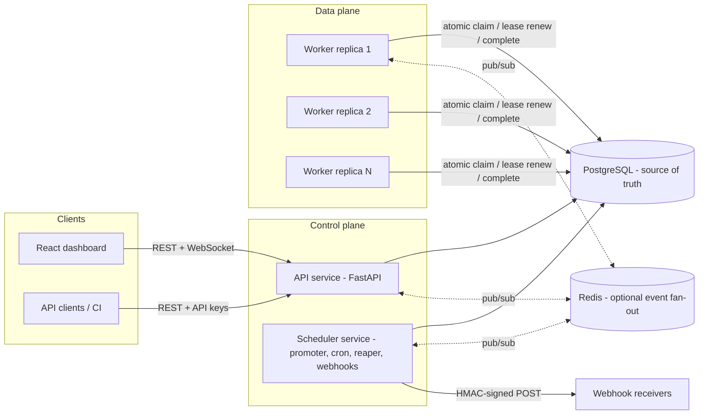
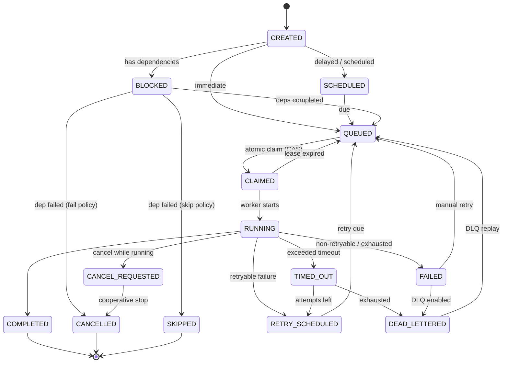
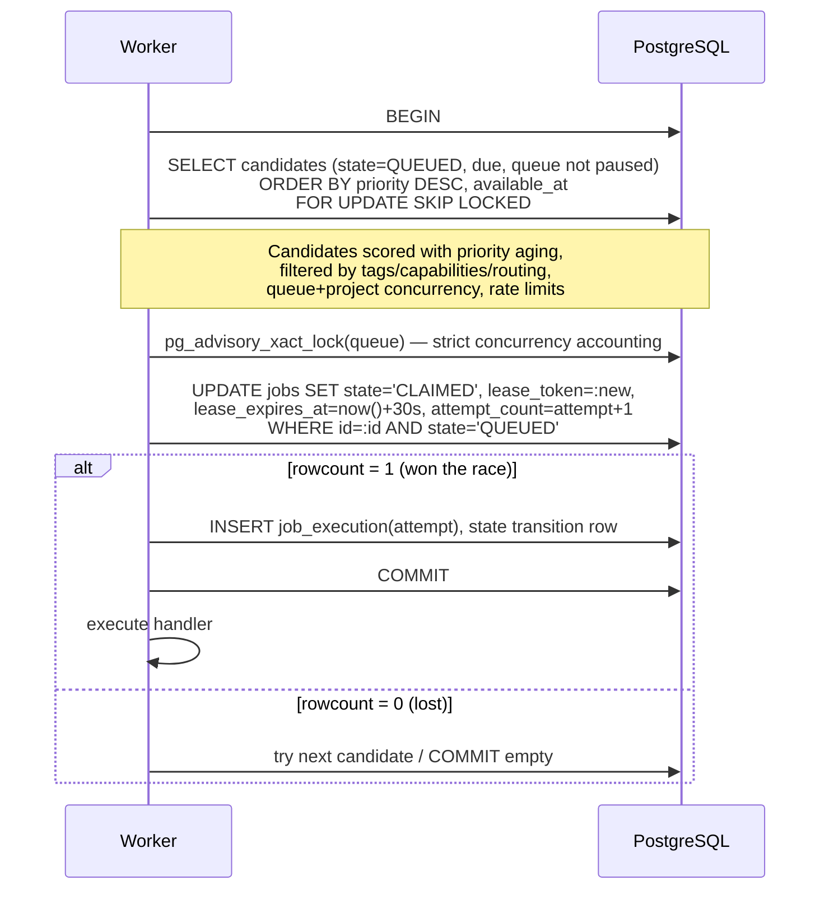
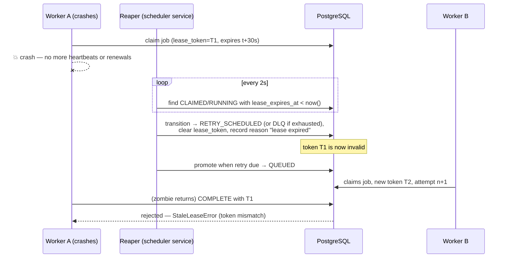

# Architecture

## System overview

**PostgreSQL is the single source of truth.** Workers and the scheduler
coordinate exclusively through transactional state in Postgres; Redis is
optional and only fans out observability events to WebSocket clients. If
Redis is absent everything still works (the UI falls back to polling).

Every loop in the scheduler service is idempotent and CAS-guarded, so you
can run N scheduler replicas for HA without duplicate effects (cron
occurrences are deduplicated by a unique index, promotions and reaps by
compare-and-set updates).

## Job state machine

All transitions go through `app/state_machine.py::transition()`, which
validates the edge and records previous state, new state, timestamp, worker,
attempt, reason and correlation id in `job_state_transitions`.

## Atomic claiming

The claim itself is the CAS `UPDATE … WHERE state='QUEUED'` — even without
row locks two workers cannot both observe `rowcount=1` for the same row, so
uniqueness per (job, attempt) holds on any SQL engine; `SKIP LOCKED` merely
removes contention on PostgreSQL.

## Worker crash recovery

The lease token rotates on every claim, so a partitioned or paused worker
that comes back after losing ownership can never overwrite the newer
attempt's result. This yields **at-least-once** semantics: the same payload
may run twice, which is why idempotency keys and idempotent handlers matter.

## Fairness

Selection order = `effective_priority DESC, available_at ASC` where
`effective_priority = priority + min(max_boost, wait_time / aging_interval)`.

* FIFO within the same effective priority (tie-break on `available_at`).
* **Priority aging** (default +1 per waiting minute, capped at +5) guarantees
  a starving low-priority job eventually outranks fresh high-priority work.
* **Per-project concurrency quotas** cap how much of the worker fleet one
  tenant can hold; **per-queue caps and rate limits** bound each queue.
* Candidate scans interleave across projects, so a tenant flooding one queue
  cannot monopolise a scan window.

## Observability

Structured JSON logs everywhere; every request/job carries a correlation id.
`/api/v1/health` (liveness), `/api/v1/ready` (DB + Redis checks) and
`/metrics` (Prometheus text format: jobs by state, queue depth, DLQ count,
worker utilization, p50/p95/p99 execution latency). The dashboard's numbers
come from the same live queries — nothing is hard-coded.
