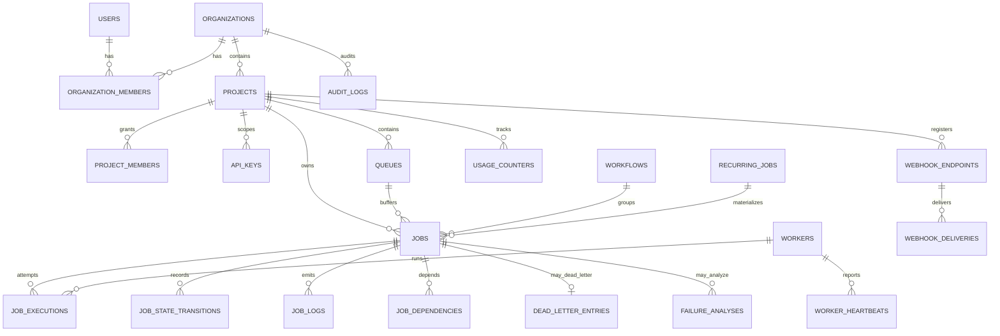

# Database design

PostgreSQL is the **source of truth** for all durable state: jobs, leases,
executions, transitions, workers, webhooks, audit. Why:

* Claiming correctness needs transactions + row-level concurrency control
  (`FOR UPDATE SKIP LOCKED`, CAS updates) — a queue in Redis cannot give us
  atomic multi-row invariants (concurrency caps, quotas, dedupe) in one commit.
* Idempotency and cron dedupe are **unique constraints**, enforced by the
  database, not by racy application checks.
* One backup/restore story; the dashboard reads the same authoritative rows.

Redis is used only for optional cross-process event fan-out (WebSockets).

## ER diagram (core)

22 tables; UUID primary keys everywhere except append-only log tables
(`job_logs`, `job_state_transitions`, `worker_heartbeats`, `audit_logs`)
which use bigserial-style autoincrement ids — cheaper indexes and natural
keyset cursors.

## Index rationale (the ones that matter)

| Index | Shape | Serves |
|---|---|---|
| `ix_jobs_claim` | (queue_id, state, available_at, priority) | the hot claim scan: equality on queue+state, range on availability, ordered by priority |
| `ix_jobs_state_avail` | (state, available_at) | scheduler promotions (SCHEDULED→QUEUED) |
| `ix_jobs_next_retry` | (state, next_retry_at) | retry promotion scan |
| `ix_jobs_lease` | (state, lease_expires_at) | reaper scan touches only leased rows |
| `uq_jobs_idempotency` | **partial unique** (project_id, idempotency_key) WHERE key IS NOT NULL | duplicate-creation protection without indexing NULLs |
| `uq_jobs_recurring_occurrence` | **partial unique** (recurring_job_id, scheduled_at) | a cron tick can never materialise twice, even with N schedulers |
| `ix_jobs_project_created` | (project_id, created_at) | job explorer default listing |
| `ix_workers_heartbeat` | (status, last_heartbeat_at) | dead-worker sweep |
| `ix_job_logs_job` | (job_id, id) | keyset (cursor) pagination of logs |
| `ix_deliveries_pending` | (status, next_attempt_at) | webhook dispatcher queue |

## Constraints & integrity

* CHECK constraints on job state, roles, worker status, progress range,
  positive concurrency limits, `job_id != depends_on_job_id`.
* FK behaviour chosen deliberately: `jobs.queue_id` is **RESTRICT** (queues
  soft-delete instead, preserving history), org→project is RESTRICT,
  project→jobs CASCADE, worker references SET NULL (history outlives workers).
* **Soft deletion only where justified**: projects and queues (children must
  remain queryable); everything else hard-deletes or is append-only.

## Transactions, locking, deadlock avoidance

* Claim = one short transaction: candidate select (SKIP LOCKED) → per-queue
  advisory xact lock → CAS update → insert execution+transition → commit.
  Locks are always taken in the same order (rows → advisory), keeping the
  window tiny and avoiding lock cycles.
* Lease renewal/completion are single-row CAS updates keyed on the lease
  token — optimistic versioning; stale owners simply get rowcount=0.
* Scheduler loops process bounded batches (LIMIT 200–500) to keep
  transactions short.

## Pagination & growth

* Job explorer: offset pagination with a bounded page size (≤200) backed by
  `ix_jobs_project_created`; deterministic tie-break on id.
* Logs and transitions: **keyset pagination** (`WHERE id > :cursor ORDER BY id`)
  — O(page) regardless of table size.
* Retention: queues carry `retention_days`; heartbeat history is pruned by
  the scheduler (6h window). Terminal-job pruning is a documented operator
  job (see DECISIONS).
